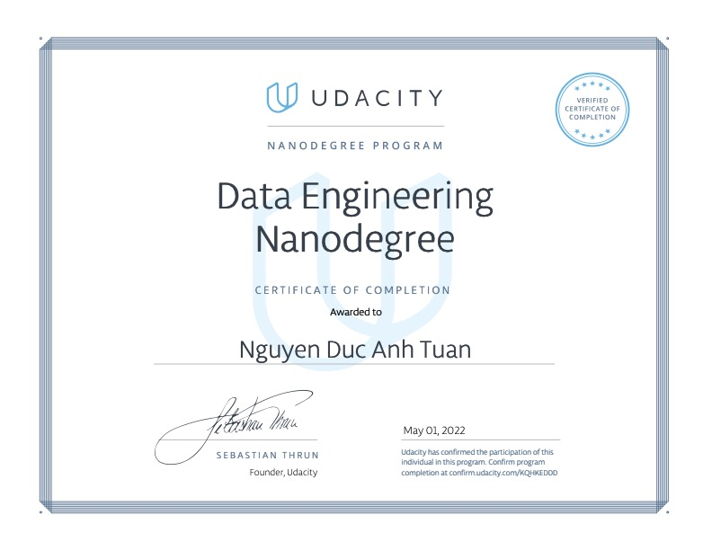

# Udacity Data Engineering Program

## Relational Database Models

- [Project 1 - Data Modeling with Posgres](https://github.com/toshi2135/udacity-data-engineering/tree/main/project-1-relational-model)

## NoSQL Data Models

- [Project 2 - Data Modeling with Apache Cassandra](https://github.com/toshi2135/udacity-data-engineering/tree/main/project-2-nosql-data-modeling)

## Data Warehouse

- [Project 3 - Data Warehousing on AWS](https://github.com/toshi2135/udacity-data-engineering/tree/main/project-3-data-warehouse)

## Data Lake

- [Project 4 - Data Lake with Spark](https://github.com/toshi2135/udacity-data-engineering/tree/main/project-4-data-lake)

## Data Pipelines

- [Project 5 - Data Pipelines with Airflow](https://github.com/toshi2135/udacity-data-engineering/tree/main/project-5-data-pipelines)

## Capstone Project

- [Capstone Project](https://github.com/toshi2135/udacity-data-engineering/tree/main/project-capstone)

## Certification

- 
